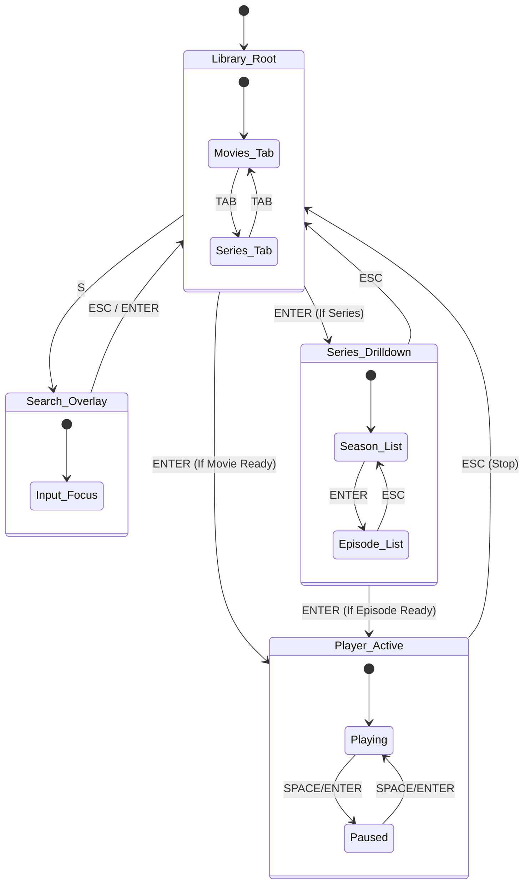

# 04_UI_UX_STATE_MACHINE.md

## 1. Global Navigation Concept
The interface acts as a hierarchical state machine. The user is always in exactly **one** specific state (Context). The `InputManager` routes keys differently based on this context.

### 1.1. Visual Style (The "Focus" Indicator)
Since there is no mouse hover, the **Active Item** must always be visually distinct.
*   **List Item Focus:** High-contrast background color (e.g., Orange or Blue) and bold text.
*   **Selected Tab:** Underlined or different background shade.
*   **Input Field:** Blinking cursor and glowing border.

---

## 2. State Diagram



---

## 3. Detailed State Definitions

### 3.1. State: `LIBRARY_ROOT` (Default)
**View:** `LibraryView` (ListView mode).
**Context:** Viewing the main list of Movies or Series.

| Key | Action | Logic |
| :--- | :--- | :--- |
| **Tab** | `SWITCH_TAB` | Toggles internal state between 'Movies' and 'Series'. Refreshes list. |
| **Up / Down** | `NAVIGATE` | Moves selection highlight up/down in the list. |
| **Enter** | `ACTIVATE` | **Movie:** If Downloaded -> Play. If Missing -> Start Download. <br> **Series:** Enter `SERIES_DRILLDOWN` state (Show Seasons). |
| **S** | `OPEN_SEARCH` | Opens `SEARCH_OVERLAY` modal. |
| **X** | `CLEAR_FILTER` | Clears active search filter, shows all items. |
| **D** | `DELETE` | Shows confirmation dialog to delete file/download. |
| **P** | `SYNC` | Triggers background metadata sync. |
| **Esc** | `NONE` | (Or Exit App if desired, usually disabled in appliance mode). |

### 3.2. State: `SERIES_DRILLDOWN` (Level 1: Seasons)
**View:** `LibraryView` (Reused, but populated with Seasons).
**Context:** Inside a specific TV Show.

| Key | Action | Logic |
| :--- | :--- | :--- |
| **Up / Down** | `NAVIGATE` | Moves selection between "Season 1", "Season 2", etc. |
| **Enter** | `DESCEND` | Enter `SERIES_DRILLDOWN` (Level 2: Episodes) for selected season. |
| **Esc** | `ASCEND` | Go back to `LIBRARY_ROOT` (Selects the Series item). |
| **Tab** | `NONE` | Ignored. |

### 3.3. State: `SERIES_DRILLDOWN` (Level 2: Episodes)
**View:** `LibraryView` (Reused, populated with Episodes).
**Context:** Inside a specific Season. Items show status (Ready/Download).

| Key | Action | Logic |
| :--- | :--- | :--- |
| **Up / Down** | `NAVIGATE` | Moves selection between episodes. |
| **Enter** | `ACTIVATE` | If Downloaded -> Play. If Missing -> Start Download. |
| **Esc** | `ASCEND` | Go back to Season List. |

### 3.4. State: `SEARCH_OVERLAY`
**View:** A modal dialog with a text input line.
**Context:** User is typing. Keyboard is captured for text entry.

| Key | Action | Logic |
| :--- | :--- | :--- |
| **Alphanumeric**| `TYPE` | Appends characters to search query. |
| **Backspace** | `DELETE_CHAR`| Removes character. |
| **Enter** | `COMMIT` | Closes overlay, **filter persists** on `LIBRARY_ROOT` list. |
| **Esc** | `CANCEL` | Closes overlay, clears filter, shows all items. |

**Note:** The search filter matches both **title** and **genres** (OR logic). Once a filter is applied via Enter, it persists until the user presses X to clear it, or opens search again.

### 3.5. State: `PLAYER_ACTIVE`
**View:** `PlayerView` (Full Screen).
**Context:** Video is rendering.

| Key | Action | Logic |
| :--- | :--- | :--- |
| **Space / Enter**| `TOGGLE_PAUSE`| Pauses/Resumes video. Shows minimal pause icon. |
| **Left / Right** | `SEEK` | +/- 10 seconds. Shows minimal seek icon. |
| **Up / Down** | `VOLUME` | +/- 5% Volume. Shows minimal volume icon. |
| **Esc** | `STOP` | Stops playback, saves resume point (to the second), **returns to exact previous Library state** (preserves drill-down context). |
| **M** | `TOGGLE_MUTE` | Mutes audio. |
| **L** | `CYCLE_AUDIO` | Cycles through **all audio tracks individually** (e.g., English, Spanish, Voiceover). |
| **Ctrl+Q** | `QUIT` | Hidden exit shortcut - exits application. |

### 3.6. State: `DIALOG_CONFIRM`
**View:** Small modal (e.g., "Delete this file?").
**Context:** Modal interruption.

| Key | Action | Logic |
| :--- | :--- | :--- |
| **Enter** | `CONFIRM` | Executes action (Delete), closes dialog. |
| **Esc** | `CANCEL` | Closes dialog, does nothing. |

---

## 4. UI Layout Specifications

### 4.1. The Main List (ListView)
**Row Height:** Fixed (e.g., 120px) to accommodate poster.
**No breadcrumbs** - clean UI, rely on Esc to navigate back.
**Columns:**
1.  **Poster (Left):** Fixed width aspect ratio. Cached locally during sync. Placeholder image if missing.
2.  **Metadata (Center):**
    *   **Line 1:** Title (Large, Bold).
    *   **Line 2:** Year | Runtime | Genre (only shown if server provides them - no TMDB enrichment).
    *   **Line 3:** Synopsis (Truncated, if provided).
3.  **Status (Right):** Icon-only.
    *   ⬇️ (Cloud/Arrow): Not Downloaded.
    *   ⏳ (Spinner/Bar): Downloading X%.
    *   ▶️ (Play Button): Ready to Watch.
    *   ⚠️ (Exclamation): Error.

### 4.2. The Status Bar (Bottom)
Always visible in `LIBRARY_ROOT` states.
*   **Left:** Connection Status (Online/Offline).
*   **Right:** Current Storage Usage - shows **lower of both** (media HDD and system SD) as the limiting factor.
*   **Center:** "Last Sync: [Time]" or "Downloading: [Speed]".

### 4.3. Toast Notifications
*   Multiple notifications **stack visually** (displayed simultaneously).
*   Each toast auto-dismisses after timeout.

---

## 5. Implementation Strategy (Pattern)

The application will implement the **State Pattern** in Python.

```python
class AppState(ABC):
    @abstractmethod
    def handle_input(self, key_event): pass

class LibraryState(AppState):
    def handle_input(self, key):
        if key == Key_Up: view.select_prev()
        elif key == Key_Enter: item = view.get_selected(); controller.activate(item)
        # ...

class PlayerState(AppState):
    def handle_input(self, key):
        if key == Key_Esc: controller.stop_playback()
        # ...
```

The `InputManager` holds a reference to `CurrentState` and delegates the key event to it.
